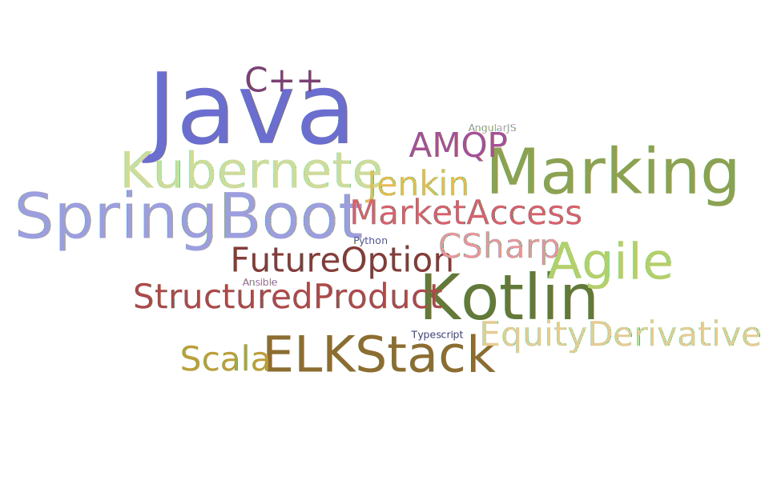

# Larry Lee - Trading System Developer
# I am :
- Passionate Kotlin/Java Developer
- Code can tell

# Skills

# Experience
##Société Générale Group
## 2019 - Now
#####Position: Volatility & Exotic Equity Rad Dev (Permanent)
#####Duty: 
- ######Working with PO and trader to maintain/develop market parameter marking micro-service for equity/index/fund and exotic product management system
- ######Coaching junior member to delivery quality software,
- ######Adapting the DevOps solution provided from GTS to improve the CICD/monitoring like Jenkins/ELK stack/Kubernetes

#####Achievement:
- ######Successfully rolling out out new service to monitor exotic product event/handover governance to other team, Market Parameter are marked up-to-date
- ######Create ELK dashboard to different applications under my team perimeter

##Bank Of China International
## 2010-2019
#####Position: Volatility & Exotic Equity Rad Dev (Permanent)
#####Duty: 
######My duty involves working with Cash Equity Team and provide function enhancement to existing FNO trading system (OMS/MDS/Market Access). Working with front officer user to provide IT support/service to support their need. Also, working with infrastructure team to establish the IT solution to user. IT document will also be conducted for future support.
#####Achievement:
- ######Migrate the persistent layer from database to coherent cache for whole FNO tradiing system 
- ######Successfully implementing and rolling new market access with HKEX
- ######Create connector to handle/process Exchange market feed message up to 30k messages/sec
- ######Implement two factors authentication
- ######Implement new trading channel for Global Options
- ######Improve SOD flow from backoffice system to front office system by 300%
- ######Achieve Zero down time on trading system

##JPMorgan Chase Bank
## 2005-2010
#####Position: Senior Analyst Programmer (Permanent)
#####Duty
######My duty involves defect fixing and implementing customer requirements to our trading system, providing real time support to production users.

# Education
######Nottingham Trent University of UK (BSc Software Engineering) : Second Upper Class Honors

[CV Link](./Resume.pdf)